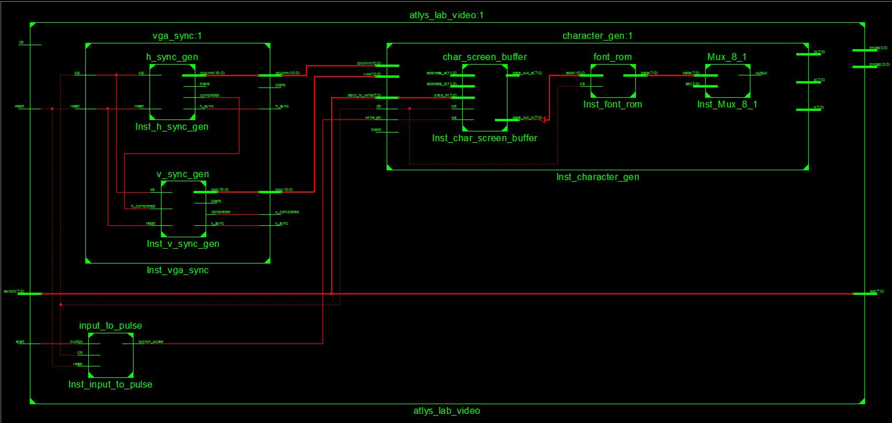

ECE 383 Font Controller Lab
===========================


Purpose
==========

The purpose if this lab was to develop a simple controller for the VGA controler I already created. The controller will
allow a user to write any ASCII character to a 30 character by 80 character grid on a monitor accepting a DVI signal. To
get a C on this lab I had to display a single character in every grid location. B was to be able to change the character
displayed at any given location using the switches on the FPGA to determine the numeric value of the ASCII character and
the buttons to either submit or switch locations. A was to be able to scroll through different ASCII selections as well
as the other B functionality requirements using a NES controller


Implementation
====================

Below is a top level view of the code used in this lab




The main additions to this lab were the 8x1 mux, the input to pulse, as well as the character generator. The mux was pretty straight forward:


```VHDL
 process(mux_out, blank) is
 begin
 		r <= (others => '0');
 		b <= (others => '0');
 		g <= (others => '0');
 	if(blank = '0') then
 		if(mux_out = '1') then
 			r <= (others => '1');
 		end if;
 	end if;	
 end process;
```

The mux simply simply decided when to light up the pixels on the screen.

The input to pulse was just a button file that took in a button press as an enable signal for the character generator.
The character generator used two delay signals for the column and 1 for the row to ensure synchronization with the rgb_pixel signal. The logic for the character gen was pretty straight forward and the meat of the code was the following
signal:
```
row_col_multiply <= std_logic_vector((unsigned(row(10 downto 4)) * 80) + unsigned(column(10 downto 3)));
```

I wasn't able to figure this out on my own and C2C Belcher had to assist me.


Test/Debug
====================

For initial testing in the prelab I created a test bench but for problems later on I relied on the monitor for testing.
The biggest problem I ran into with this lab was my delays. Originally, my display was extremely shifted to the right
and after making some modifications it got closer but there was still a very noticable gap on the left side of the screen. It wasn't until I added in delays for h_sync and v_sync and not just the blank delays that I origially had that I was able to get all of my letters to appear correctly.

